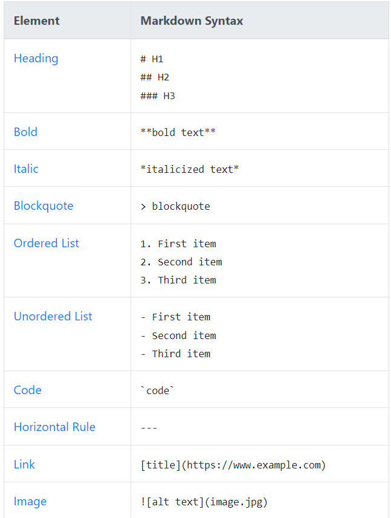

# NEVERBACKDOWN
## Class practice 

> **GET READY FOR EPIC SYNTAX**
*-Mayank Malik 2023*

1. Heading
2. Bold
3. Italic

- Blockquote
- Ordered List
- Unordered List

`print ("Hello World")`

---

[Source](https://www.markdownguide.org/cheat-sheet)



| Table Example | Example of a table |
| ----------------- | ----------|
| EXAMPLES | Example 1 |
| Hi! My name is Aidan, a core member of the NEVERBACKDOWN team. | Join today!

```
{
    "Member 1": "Aidan",
    "Member 2": "Kenric",
    "Member 3": "Arin" 
}
```

We reserve the right to refuse service to anyone.
[^1]

[^1]: We also reserve the right to give service to anyone.

### NEVERGIVEUP {}

<h3 id="customi-id">My Great Heading</h3>

Copulate
: to have sexual intercourse

~~ALWAYSGIVEUP~~

- [x] List your givens
- [x] Find the unknown
- [x] Find the kinematic equation required

HAHA :joy:

Highlight ==DONT FORGET THE ADD THE SEMICOLON==